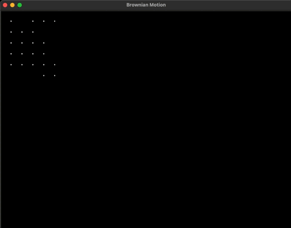

# Моделирование броуновского движения с использованием Tkinter

## Аннотация

В данной работе представлен симулятор броуновского движения, который визуализирует случайное блуждание микрочастиц в двумерном пространстве. Моделирование выполняется с помощью языка программирования Python и графической библиотеки Tkinter. Целью данного проекта является наглядная демонстрация принципов броуновского движения и стохастических процессов.

## Введение

Броуновское движение, названное в честь шотландского ботаника Роберта Броуна, представляет собой случайное движение микроскопических частиц, взвешенных в жидкости или газе. Это явление объясняется бесконечным количеством микроскопических столкновений с молекулами окружающей среды, что приводит к хаотическому перемещению частиц. Броуновское движение служит важной основой для различных научных дисциплин, включая физику, химию и биологию, а также для приложений в финансовой математике и статистике.

Моделирование броуновского движения предоставляет возможность лучше понять динамику случайных процессов и позволяет визуализировать их поведение. Это может быть полезно в образовательных целях, а также для исследований в области статистической механики.

## Методология

### Математическое описание

Броуновское движение можно описать как случайный процесс, где каждое изменение положения частицы является независимым от предыдущих изменений. Для простоты моделирования используется дискретное время и фиксированный размер шага. Если \( X_n \) обозначает положение частицы после \( n \)-го шага, то изменение координаты может быть записано как:

\[ X_{n+1} = X_n + \Delta X_n \]

где \( \Delta X_n \) - это случайная величина, принимающая значения в одном из направлений: вверх, вниз, влево или вправо, с равной вероятностью.

### Процесс моделирования

1. **Инициализация**: Создается виртуальное пространство размером 800x600 пикселей, представляющее область, в которой частица будет перемещаться.
2. **Начальные условия**: Частица начинает свое движение из центра этого пространства.
3. **Случайное блуждание**: На каждом шаге частица изменяет свое положение, выбирая одно из четырех направлений (вверх, вниз, влево, вправо) с равной вероятностью.
4. **Ограничения области**: Движение частицы ограничено границами виртуального пространства, что предотвращает ее выход за пределы окна.
5. **Визуализация**: Каждое новое положение частицы отображается на экране в виде точки, формируя видимую траекторию, которая иллюстрирует характерное поведение броуновского движения.

## Результаты

В результате выполнения симулятора на экране отображается траектория движения частицы, представляющая собой случайные перемещения. Наблюдая за движением частицы, можно заметить характерные особенности броуновского движения, такие как его непредсказуемость и случайный характер. Траектория демонстрирует сложность взаимодействия между частицей и молекулами среды.

Ускорено в 10 раз

## Заключение

Моделирование броуновского движения представляет собой полезный инструмент для визуализации и понимания случайных процессов. Данный проект демонстрирует, как простые алгоритмы могут быть использованы для иллюстрации сложных физических явлений. Программа может быть дополнена для исследования различных аспектов броуновского движения и других случайных процессов, а также служить основой для более глубокого изучения статистической механики.

## Библиография

- Броун, Р. (1828). "О движении взвешенных частиц в жидкостях".
- Улембек, Г.Э., & Орнштейн, Л.С. (1930). "On the Theory of the Brownian Motion".
- Финкельштейн, Л. (2008). "Основы теории вероятностей и математической статистики".
# brownian_motion
